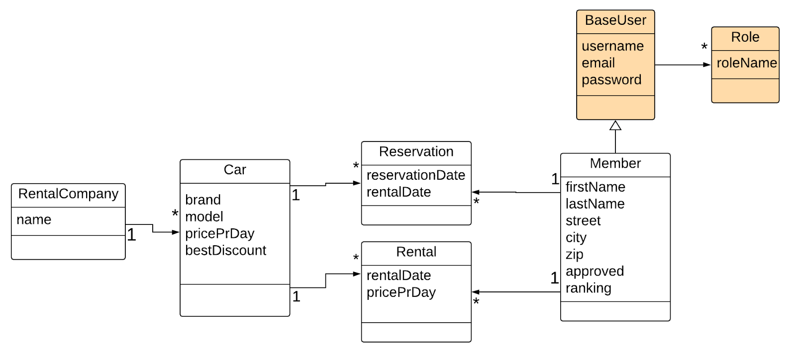

# Cars 'R' Us

## Implemented Entity classes
with all attributes from domain model, and foreign keys
associations using @OneToMany and @ManyToOne

- [x] Member extends BaseUser
- [x] Car
- [x] Reservation
- [x] Rental

## Implemented Repository classes
most of these have only a few extra methods

- [x] MemberRepository
- [x] CarRepository
- [x] ReservationRepository
- [x] RentalRepository

## Implemented Repository Tests
below each class is listed the methods that have tests written

- [ ] MemberRepositoryTest
  - [x] count()
- [ ] CarRepositoryTest
  - [x] count()
- [ ] ReservationRepositoryTest
- [ ] RentalRepositoryTest

## CI / CD
Der er lavet en fil, .github/workflows/build-and-test.yaml, som aktiverer en github action
Denne github action består essentielt bare af at køre `./mvnw test` 

